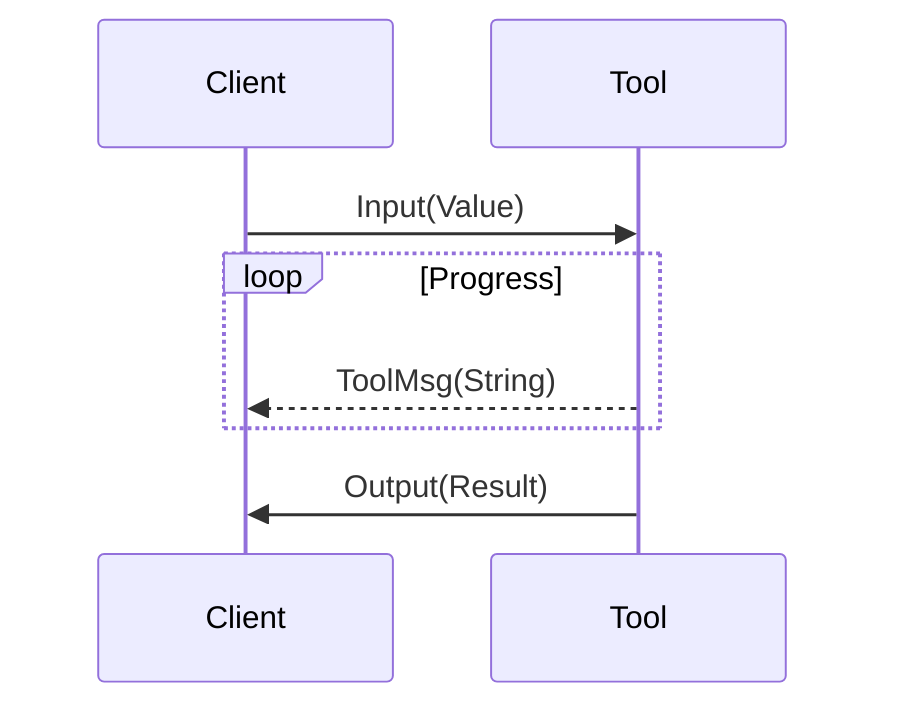

The **MRX ToolAPI** is a cross-language framework for connecting MRI simulation and analysis **tools** with **clients**. It provides a strongly-typed value system for MR domain data and an opaque communication layer, so that calling a remote tool feels like calling a local function.

ToolAPI is the foundation of the MRX ecosystem: all [[tools/index|tools]] are built on it, and all [[apps/index|apps]] use it to invoke tools.

## Core Concepts

### Tool

A **tool** is a standalone server program. It receives a [[toolapi/values/index|Value]] as input, performs its computation (optionally reporting progress via messages), and returns a [[toolapi/values/index|Value]] as output. Tools are currently hosted on [Fly.io](https://fly.io/) but can as easily be run locally (typically only requiring a Python or Rust installation).

Tools are language-agnostic: they can be written in any language that has a ToolAPI [[toolapi/implementations|implementation]]. Currently, tools are written in Rust and Python.

### Client

A **client** is any environment that invokes tools. Examples include:

- A web application like the [No-field Scanner](https://mrx-org.github.io/nofield/)
- A Python script optimizing a sequence using simulation tools
- A Jupyter notebook for interactive MR experimentation
- An MCP shim exposing tool capabilities to LLMs

From the client's perspective, invoking a tool is a single function call: `call(address, input, on_message)`. The limited, well-defined set of [[toolapi/values/index|value types]] ensures that tools with similar purposes can be exchanged freely, even if written independently by different people.

### Connection

The communication between client and tool is **deliberately opaque**. Neither tool nor client code interacts with the transport layer directly. This avoids lock-in and allows the protocol to be improved without requiring code changes on either side.

Currently, communication uses **WebSocket** with **MessagePack** serialization compressed via **zstd**. Tools are hosted as WebSocket servers (e.g. on [Fly.io](https://fly.io/)), making them accessible from any platform including web browsers.

## Protocol

The wire protocol consists of four message types:

| Message                            | Direction      | Description                          |
| ---------------------------------- | -------------- | ------------------------------------ |
| `Input(Value)`                     | Client -> Tool | Parameters sent to the tool          |
| `ToolMsg(String)`                  | Tool -> Client | Progress messages during computation |
| `Output(Result<Value, ToolError>)` | Tool -> Client | Final result or error                |
| `Abort`                            | Client -> Tool | Request the tool to stop             |

A typical call lifecycle:

1. Client connects via WebSocket and sends `Input(Value)`
2. Tool processes the input, sending zero or more `ToolMsg` updates
3. Tool sends `Output` with the computed result (or an error)
4. Connection closes

The client's `on_message` callback receives each `ToolMsg` and can return `false` to trigger an `Abort`.

## Further Reading

- [[toolapi/values/index|Value Types]] -- the canonical data types exchanged between clients and tools
- [[toolapi/implementations|Implementations]] -- language-specific bindings (Rust, Python, JavaScript/WASM)
